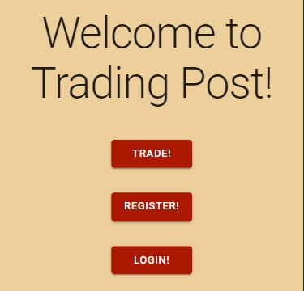
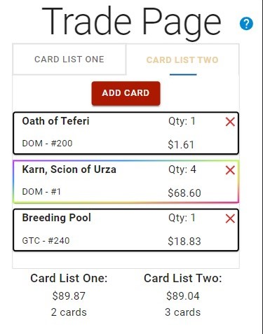
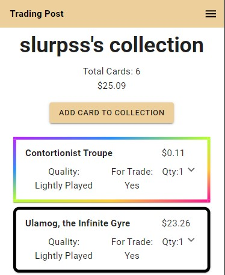

# [Trading Post][url]
[url]:trading-post.surge.sh

## Purpose
The goal of Trading-Post is to provide Magic: The Gathering plays with a tool that reduces the amount of time it takes to check the value of cards during a trade. Due to the nature of the secondary-market, card prices fluctuate, and when players trade they want to make sure they are trading for cards of equivalent value. This site allows users to create two lists of cards and compare the monetary value of both lists.

On top of that, users can create an account and track their collection of cards in the site. They can also create a for trade list and a want list, which in the future will be used to find trades for the users so they can get the cards they want faster.

## Features

### Trade Page

This is where users can build their trades using card list one and card list two. Users can select the list they wish to add to, click the add card button, and a modal will pop up prompting them to either search for a card by name, or use their camera to take a photo of the card, and the modal will populate with the found card. I'm using tesseract.js for Optical Character Recognition. It currently works most of the time for the standard Magic card. In the future I would like to revamp this, and have it work for split cards, and alternate art Secret Lair printings.

Once the users have completed the list, they can see the value of each list and the amount of cards in each list at the bottom of the page. From there the users can decide whether they want to do the trade or not. In the future I will be adding a button where a logged in user can commit the trade, and the cards they traded will be removed from their collection, and the cards they gained will be added to their collection.

This page cuts down the amount of time it takes to check a group of cards value. In the past when I have traded cards, it involved looking up each card individually on TCGPlayer, and keeping a running total of card value in a phones calculator app. This site lets users see the value in one place, and gives the the total sum of their cards prices automatically.

### User Collections/For Trade Lists/Want Lists

This page is where users can see their collections. They can add cards to their collections the same way they would add cards to a trade list, and also edit the cards in their collections. These changes persist, as a users collection and want list are stored in our database through our backend API.

The page uses the same React component as the For Trade and Want List pages. So behavior is consistent across the different pages.

This allows users to track their collections, and in the future it will allow the site to compare different users want lists and for trade lists, and recommend trades, to improve the chances of users finding the right trade and getting the cards they want.

## Testing

All tests can be found next to the files that they are testing.
### Backend
There are unit tests for all helpers, models, and routes pertaining to the backend API. These ensure that the API works consistently.

To run tests, navigate to the /backend directory and run "jest".

### Frontend
There are unit tests for all components, and integration tests for larger features, like logging in, registering, adding/removing/editing cards in a collection.

Testing can be expanded with end-to-end tests, and integration tests for the trade page, but as this project is still a work in progress, things can change which would result in flimsy tests.

To run tests, navigate to front end directory and run "npm test".

## User Flow
A typical user flow would involve a user reaching the landing page of the site. They are then prompted with a trade button, a login button, or a register button. Users can click the trade button to be taken to the trade page, then they can start building their trades. Users should not have to log in in order to use the trading functionality of the site.

Once on the trade page, a user can begin to build their trade by adding cards to each card lists. They click the add card button to open a modal, where they can search for a card by name or take a photo of a card with their camera. Once a card is found, a form will appear below the search bar and they can enter in additional information about the card, such as printing, foil or non-foil, condition, and quantity. Once the form is complete they click the Add Card button and the card will be added to the list.

The flow repeats until both card lists are complete, and then the users can decide whether to commit the trade or not. 

## API

I am seeding the database with card data and prices from [Scryfall API][API]. I am using their bulk data file, which is updated daily with any new cards and updated price information.

Currently the price information is out of date. In the very near future I will implement a script that downloads the bulk data from scryfall, updates price information for all cards, and also inserts new cards into the table if needed.

The site makes request to an Express.js API that I built. You can find this in the backend folder. It is a basic CRUD API that returns card and user data. In the future it will return compatible trades between users.

[API]: https://scryfall.com/docs/api

## Tech Stack
Frontend: JavaScript, [React][react], and [Material UI Core][material-ui] for the front-end. The site is a single page application, using [react-router-v6][react-router] for client side routing. I am using [tesseractjs][tesseract] for Optical Character Recognition of card photos.

[react]: https://react.dev/
[material-ui]: https://mui.com/material-ui/getting-started/
[react-router]: https://reactrouter.com/en/main
[tesseract]: https://tesseract.projectnaptha.com/

Backend: [Node.js][node] and [Expressjs][express] are used to run the server. We use [node-pg][nodepg] in our models to create a simple ORM for database interaction. We handle authentication using JWTs, and data validation using JSONSchemas.

[node]: https://nodejs.org/en
[express]: https://expressjs.com/
[nodepg]: https://node-postgres.com/

## To-Dos

This site was a Capstone project for the Springboard Software Engineering Track. I have uploaded this code as a requirement to finish the course, but I plan to continue working on the site. That said, these are the things I wish to complete:

#### Automatically update card data
Write a script to download bulk data file from Scryfall API, read the file, and update the card prices for cards in the database, and add any new cards to the database.

#### Implement email verification
Have users verify their email address by sending an automated email when they sign up.

#### Implement better form validation
Find a front-end library for form validation and include it for the login and register forms. Currently this is happening on the back-end.

#### Implement Recommended Trades
Compare users for trade collection and other users want list, along with allowing users to enter their zip code information, create a feature that recommends trades to users. Users can connect through the site, message, and arrange a meet up to trade their cards.

#### Increase Accessibility
This site should be accessible to everyone.

#### Implement Computer Vision Card Recognition
Taking a photo of one card at a time is faster than the current trade process, but with Machine Learning it's possible to take a photo of ever card in the pile and recognize each of them. This is going to require a lot of research on my part, but I do have some leads on how to achieve this.